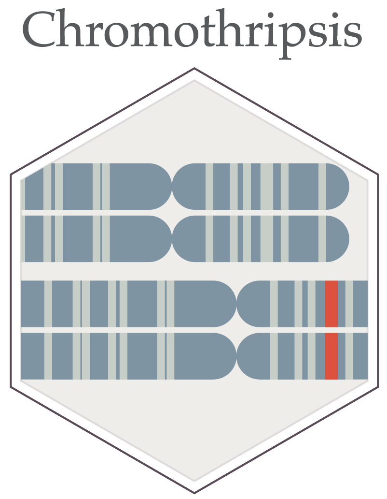
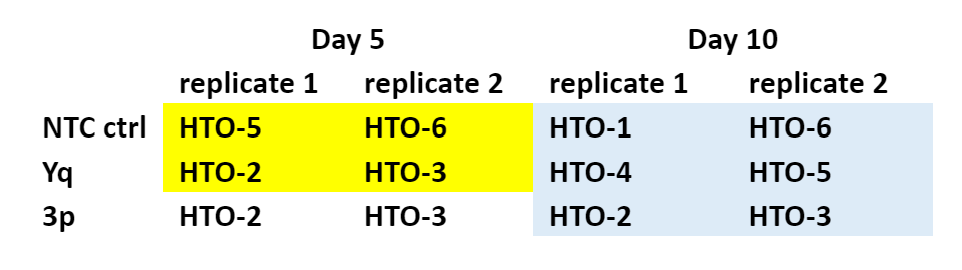

# Chromothripsis_2

A full scale single cell experiment with Drs. Peter Ly and Rashmi Dahiya.

### Overall Design

RPTECs (Renal Proximal Tubule Epithelial Cells), treated with three different CRISPR-RNPs and population prepared for sequencing for two time points: Day5 and Day10. Single cell suspensions were stained with unique human hashtaging antibodies (HTOs) and pooled into three 10x Chip G lanes. 2x libraries from each lane (transcriptome and HTO) are sequenced separately on a NovaSeq X machine.

### Cell hash tagging

We used scRNA-seq (10x Gemoics-based) coupled with CITE-seq based HTO label to profile and compare transcriptomes of RPTEC cells after different CRISPR-RNP perturbations. The samples sequenced are as follows: Lane 1 – Sample names: sgNTC-D5 (HTO-5 and HTO-6) and sgYq-D5 (HTO-2 and HTO-3). Lane 2 – Sample name: sg3p-D5 (HTO-2 and HTO-3). Lane 3 – Sample names: sg3p-D10 (HTO-2 and HTO-3), sgYq-D10 (HTO-4 and HTO-5), sgNTC-D10 (HTO-1 and HTO-6).

### Experiment Information

08/02/24 and 08/07/24 Platform NovaSeq X Plus (PE150)

L1 Actual reads\
UTSW20_L1_mRNA_SI_TT_A1 1,008,161,478 ; UTSW20_L1_HTO_D701 159,451,296

L2 Actual reads\
UTSW20_L2_mRNA_SI_TT_A2 987,937,385 ; UTSW20_L2_HTO_D702 168,214,874

L3 Actual reads\
UTSW20_L3_mRNA_SI_TT_A3 921,456,798 ; UTSW20_L3_HTO_D703 153,664,291

### RAW data and Pre-processing

-   Raw NovaSeq X FASTQ files and Cell Ranger filtered matrices are available from GEO (accession GSEXXXXXX).
-   Intermediate R data objects (integrated Seurat object, post-inferCNV object, DEG/GSVA inputs) needed to reproduce the figures are archived on Zenodo: [10.5281/zenodo.20779472](https://doi.org/10.5281/zenodo.20779472).
-   RAW fastq files were processed using Cellranger v7.2 (10x genomics) by using cellranger's "Antibody Capture" module. The "./filtered_feature_bc_matrix" outputs from cellranger was loaded in Seurat v5 for downstream analysis.

### Single Cell Transcriptome Analysis

We performed standard Seurat analysis and generated cell clusters, marker genes, and associated feature plots. The genome changes were future analyzed using [InferCNV R package](https://github.com/broadinstitute/infercnv).
